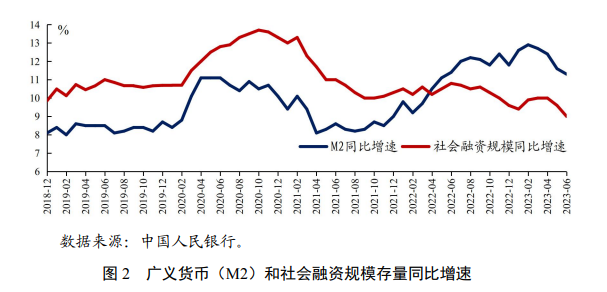

## [2023年第二季度](https://www.gov.cn/lianbo/bumen/202308/P020230818263426256347.pdf)

- 稳健的货币政策
    - 保持货币信贷合理增长。综合运用降准、再贷款再贴现、中期借贷便利、公开市场操作等
    - 推动实体经济融资成本文中有降。发挥政策利率引导作用，6月、8月公开市场逆回购操作和中期借贷便利中标利率分别合计下行20个和25个基点
    - 持续发挥结构性政策工具作用
    - 兼顾内外汇均衡
    - 强化风险防范化解

|指标|数值|同比|
|:---:|:---:|:---|
|1-6月GDP| |+5.5%|
|CPI | |+0.7%|
|1-6月新增人民币贷款|15.7万亿元|+2万亿元|
|6月末人民币贷款余额|230.6万亿元|+11.3%|
|6月末M2||+11.3%|
|6月末社融存量||+9.0%|
|6月末普惠小微贷款余额||+26.1%|
|6月末制造业中长期贷款余额||+40%|
|6月新发放企业贷款加权平均利率|3.95%|-0.21%|
|6月末个人住房贷款加权平均利率|4.11%|-0.51%|
|6月末金融机构超额准备金率|1.6%|+0.1%|

